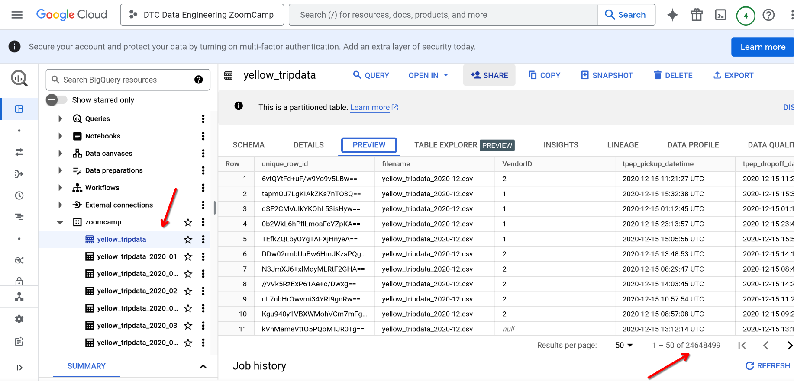

# Kestra Module Quiz Questions

Complete the Quiz shown below. It’s a set of 6 multiple-choice questions to test your understanding of workflow orchestration, Kestra and ETL pipelines for data lakes and warehouses.

1. Within the execution for `Yellow` Taxi data for the year `2020` and month `12`: what is the uncompressed file size (i.e. the output file `yellow_tripdata_2020-12.csv` of the `extract` task)?

  

- [x] 128.3 MB
- [ ] 134.5 MB
- [ ] 364.7 MB
- [ ] 692.6 MB

1. What is the rendered value of the variable `file` when the inputs `taxi` is set to `green`, `year` is set to `2020`, and `month` is set to `04` during execution?

- [ ] `{{inputs.taxi}}_tripdata_{{inputs.year}}-{{inputs.month}}.csv`
- [x] `green_tripdata_2020-04.csv`
- [ ] `green_tripdata_04_2020.csv`
- [ ] `green_tripdata_2020.csv`

3. How many rows are there for the `Yellow` Taxi data for all CSV files in the year 2020?

  

- [ ] 13,537.299
- [x] 24,648,499
- [ ] 18,324,219
- [ ] 29,430,127

4. How many rows are there for the `Green` Taxi data for all CSV files in the year 2020?

  

- [ ] 5,327,301
- [ ] 936,199
- [x] 1,734,051
- [ ] 1,342,034

5. How many rows are there for the `Yellow` Taxi data for the March 2021 CSV file?

  

- [ ] 1,428,092
- [ ] 706,911
- [x] 1,925,152
- [ ] 2,561,031

6. How would you configure the timezone to New York in a Schedule trigger?

  
  

[Kestra Documentation](https://kestra.io/plugins/core/triggers/io.kestra.plugin.core.trigger.schedule)
- [ ] Add a `timezone` property set to `EST` in the `Schedule` trigger configuration  
- [x] Add a `timezone` property set to `America/New_York` in the `Schedule` trigger configuration
- [ ] Add a `timezone` property set to `UTC-5` in the `Schedule` trigger configuration
- [ ] Add a `location` property set to `New_York` in the `Schedule` trigger configuration
